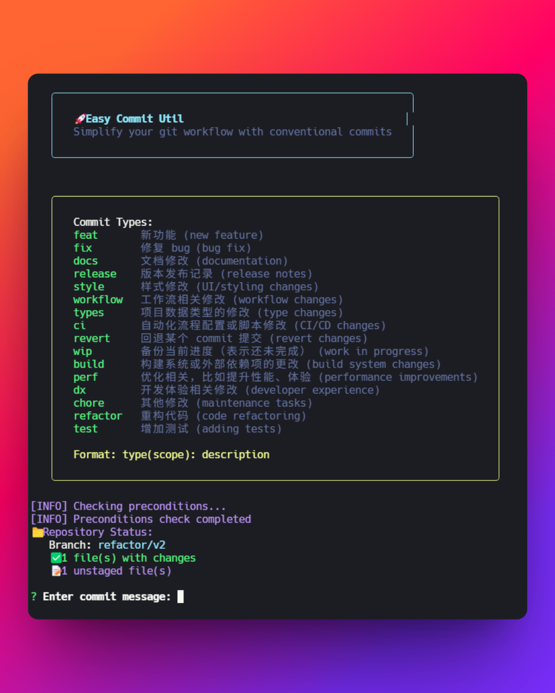

<h1 style="text-align: center;">easy-commit-util</h1>
<p style="text-align: center;"><span> English | <a href= "./README.zh.md"> 中文 </a></span></p>

<p align="center">
  <a href="https://typescriptlang.org"></a>
  <a href="https://nodejs.org"></a>
  <a href="LICENSE"></a>
</p>

<p style="display: flex; justify-content: center; align-item: center;">

</p>

> **Version 2.0** - Complete TypeScript rewrite with improved architecture and user experience

easy-commit-util is a powerful command-line tool written in TypeScript that simplifies git commits with conventional commit format validation and an enhanced interactive experience.

## ✨ New Features in v2.0

- **🚀 TypeScript Support** - Fully rewritten in TypeScript with type safety
- **🎨 Enhanced UI** - Beautiful CLI interface with colors, spinners, and interactive prompts
- **🔧 Modular Architecture** - Clean separation of concerns for better maintainability
- **⚡ Smart Validation** - Real-time commit message validation with helpful feedback
- **🎯 Interactive Mode** - Guided commit creation with type selection
- **⚙️ Configuration System** - Customizable settings via config file
- **📊 Status Monitoring** - Detailed repository status display
- **🧪 Comprehensive Tests** - Unit tests for core functionality

## 📦 Installation

### Global Installation (Recommended)
```bash
npm install -g easy-commit-util
# or
pnpm install -g easy-commit-util
# or
yarn global add easy-commit-util
```

### Development Installation
```bash
git clone https://github.com/yaolifeng0629/simple_push.git
cd easy-commit-util
npm install
npm run build
npm link
```

## 🚀 Usage

### Quick Start
```bash
easy-commit          # Interactive mode
easy-commit commit   # Same as above
easy-commit c        # Short form
```

### Command Options
```bash
# Quick commit with message
easy-commit -m "feat: add login functionality"

# Interactive mode with options
easy-commit --interactive

# Skip push to remote
easy-commit --no-push

# Skip adding all files
easy-commit --no-add

# Validate a message
easy-commit validate "feat(auth): add user authentication"

# Show repository status
easy-commit status

# Manage configuration
easy-commit config --sample
```

## 🎯 Interactive Mode

The new interactive mode provides a guided experience:

1. **Repository Status** - Shows current branch and file changes
2. **Commit Type Selection** - Visual list with descriptions
3. **Scope Input** - Optional scope with validation
4. **Description Input** - Real-time length and format validation
5. **Breaking Changes** - Optional breaking change indicator
6. **Confirmation** - Preview before committing

## ⚙️ Configuration

Create a configuration file in your home directory:

```bash
easy-commit config --sample
```

### Configuration Options (`~/.easy-commit.json`)
```json
{
  "commitTypes": ["feat", "fix", "docs", ...],
  "maxDescriptionLength": 50,
  "allowBreakingChanges": true,
  "pushAfterCommit": true,
  "addAllFiles": true
}
```

## 📋 Commit Types

| Type | Description | Example |
|------|-------------|---------|
| `feat` | New features | `feat: add user login` |
| `fix` | Bug fixes | `fix(auth): resolve token issue` |
| `docs` | Documentation | `docs: update API docs` |
| `style` | Code style | `style: format code with prettier` |
| `refactor` | Code refactoring | `refactor: simplify auth logic` |
| `perf` | Performance | `perf: optimize database queries` |
| `test` | Tests | `test: add auth unit tests` |
| `chore` | Maintenance | `chore: update dependencies` |

## 🛠️ Development

### Setup
```bash
npm install
```

### Development Commands
```bash
npm run dev          # Watch mode compilation
npm run build        # Build TypeScript
npm run lint         # ESLint
npm run format       # Prettier
npm start           # Run CLI
```

## 📄 License

This project is licensed under the ISC License - see the [LICENSE](LICENSE) file for details.

## 🙌 Acknowledgments

- Inspired by [conventional commits](https://www.conventionalcommits.org/)
- Built with modern TypeScript and Node.js
- Thanks to all contributors who helped make this tool better!

---

**Made with ❤️ by the <a href="https://yaolifeng.com">Immerse</a>**
