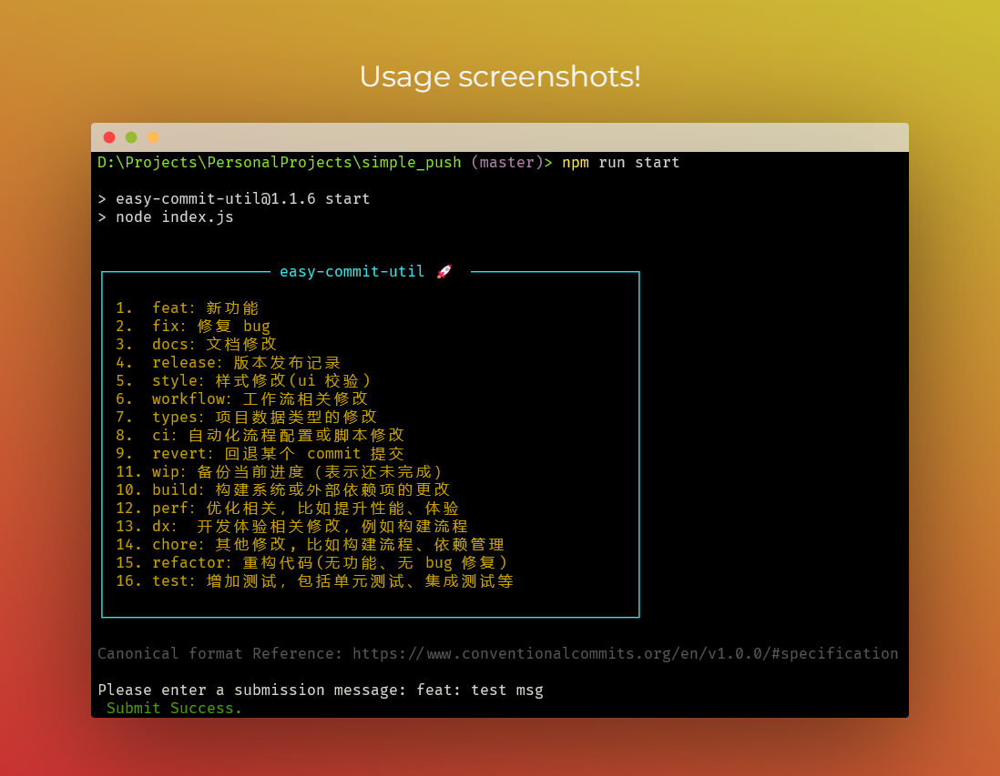

<h1 style="text-align: center;">easy-commit-util</h1>
<p style="text-align: center;"><span> English | <a href= "./README.zh.md"> 中文 </a></span></p>
<p style="text-align: center;">easy-commit-util 是一个使用 Node.js 编写的命令行工具，它可以简化和自动化你的 git 提交过程。</p>

<p style="display: flex; justify-content: center; align-item: center;">

</p>

>
>   `如果您不想强制验证提交格式，请安装版本@1.1.6，否则，请安装版本@1.1.6或更高版本`
>

## 功能

-   自动检测当前目录是否是一个 git 仓库
-   如果是 git 仓库，会提示你输入提交消息
-   自动执行`git add .`，`git commit -m "<message>"`和`git push`命令

## 🚀 使用方法
1.  全局安装
```bash
pnpm install -g easy-commit-util

npm install -g easy-commit-util
```
2.  在终端中运行
```bash
easy-commit-util

# 输入commit信息
# 回车即可

# Tips:
# 命令行输入 easy 按 Tab 键即可自动补全，不需要手动敲名字
```
## ⚠️ 注意事项

-   确保你的机器上已经安装了 Node.js 和 git
-   确保你已经在 git 仓库中配置了正确的远程仓库

## 🙌 贡献

-   我们欢迎所有的贡献和建议。如果你想为 easy-commit-util 做出贡献，你可以：

    -   提交 bug 报告或建议
    -   提交代码改进或新功能
    -   改进文档

-   感谢所有已经为 easy-commit-util 做出贡献的人！🎉
